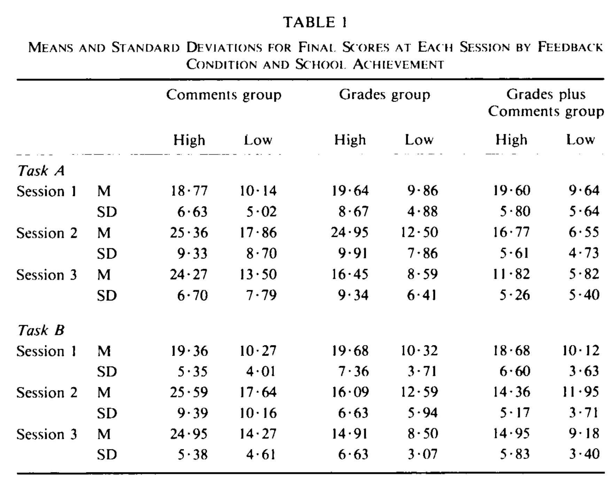

# Syllabus

## Logistics

CU Boulder: CSCI 5636-001(B) (Fall 2022)

Meeting Time: MWF 11:15-12:05 in ECCS 1B14

### Remote access via Zoom

* Join via web browser: https://cuboulder.zoom.us/j/99670441691
* Join via Zoom app (using meeting 996 7044 1691)

### Recordings

Recordings will be available in Canvas Mediasite.

### Instructor: [Jed Brown](https://jedbrown.org), [`jed.brown@colorado.edu`](mailto:jed.brown@colorado.edu), ECOT 824

* Office hours: [Choose a time](https://app.simplymeet.me/jed/numpde)

:::{tip}
Chat sessions are important for asking questions, solving problems, discussion of broader academic and career strategy, and to provide feedback so I can make the class serve your needs and those of people with similar experiences and interests.
:::

## Overview

Partial differential equations (PDE) describe the behavior of fluids, structures, heat transfer, wave propagation, and other physical phenomena of scientific and engineering interest.
This course covers discretization of PDE using finite difference and collocation methods, finite volume methods, and finite element methods for elliptic, parabolic, and hyperbolic equations.
For each method, we will discuss boundary conditions, generalization to high order, robustness, and geometric complexity.
We will discuss foundational principles like will posedness, verification, and validation, as well as efficient methods for solution of the discretized equations and implementation in extensible software. 

## Organization

We will start with a brief refresher on numerical integration, approximation of functions, and numerical differentiation.  We will extend this to finite difference methods for elliptic problems (like heat and pressure equilibrium) and time integration, producing methods that converge with arbitrarily high orders of accuracy.  We will discover challenges when applying these methods to hyperbolic equations (which describe wave propagation and transport phenomena), especially nonlinear hyperbolic equations, and thus develop finite volume methods which rely on weaker assumptions.  We will learn about shocks, rarefactions, and Riemann solvers.  Finite volume methods are easy to use in complicated geometries and/or unstructured meshes, but achieving high order accuracy in such settings is unnatural and the methods can be awkward for elliptic and parabolic equations.  Finite element methods offer a flexible and robust analysis framework as well as modular implementation that allows arbitrary order of accuracy even in complicated domains.  We will introduce relevant concepts in continuum mechanics as we go.

In the second half of the semester, we will transition to more project-based learning.
You will choose an open source software package with an active community and give a presentation to the class about the choice of methods, stakeholders and community functioning, and identify opportunities for contribution.
You'll then form small teams of like interest and work on a contribution to be shared with the community.
(Such contributions can take many different shapes, and need not involve code.)

## Outcomes

Partial differential equations underly a broad range of high-fidelity models in science and engineering from atomic to cosmological scales.
Upon completing this course, students possess an ability to

* formulate problems in science and engineering in terms of partial differential equations
* understand the merits and limitations of the leading numerical methods used to solve PDE
* recognize and exploit structure to apply algorithms that improve performance and scalability
* select and use robust software libraries
* develop effective numerical software, taking into account stability, accuracy, and cost
* predict scaling challenges and computational costs when solving increasingly complex problems or attempting to meet real-time requirements
* interpret research papers and begin research in the field

## Ungrading

I'm here to be your partner, not your adversary, and I promise not to waste your time. 
So I won't grade (score) your work, though I will write feedback and meet with you to reflect and discuss strategy for growth.
Why? TL;DR: {download}`Evidence <downloads/Butler-EnhancingAndUnderminingIntrinsicMotivation-1988.pdf>` shows that scoring undermines the value of writing comments.

## GitHub

We'll use Git with GitHub Classroom for managing activities and feedback. During the project-based learning later in the semester, you'll likely interact with open source communities using these tools.

You are encouraged to work together on assignments, but must give credit to peer contributions via the commit messages or Git history. For example, you would add

    Suggested-by: Friendly Neighbor <friendly.neighbor@colorado.edu>

to the commit message if that code incorporates an approach suggested by your neighbor. You should ensure that each assignment (pull request) contains some of your own meaningful intellectual contributions.

## Programming languages and environment

I will primarily use Julia and [Jupyter notebooks](https://jupyter.org/) for slides and activities in class.  This environment is convenient to work with, general purpose, and has extensive library support.  It is possible to write fast code in Julia, though performance implications can by mysterious. C, C++, and Fortran are popular languages for writing production numerical software, sometimes called from a higher level programming language like Python.  MATLAB is also popular for numerical computing, though it is a proprietary environment and lacks general-purpose libraries. Rust is an exciting young language, albeit with limited numerical library support at this time.

We will make use of libraries written in several languages, and I'll focus on the abstraction rather than minutia of the language. You don't need prior experience in any particular language, but please bring a growth mindset and ask for help as needed (from myself and peers -- GitHub discussions are a good place for this).

Most HPC facilities use a Linux operating system and many open source software packages and libraries will have the best documentation and testing on Linux systems. You can use any environment for your local development environment, or use the CS Department's JupyterHub [coding.csel.io](https://coding.csel.io/) to experiment and develop without a local install.

## Target audience

Graduate students in computer science or simulation-based science or engineering.  Suggested prereq: at least one of

* CSCI-2820 Linear Algebra
* CSCI-3656 Numerical Computation
* CSCI-4576 High-Performance Scientific Computing

## Resources (updated continuously)

* [SIAM Membership](http://www.siam.org/students/memberships.php) is free for CU students, 30% discount on SIAM books
* [LeVeque, *Finite Difference Methods for Ordinary and Partial Differential Equations*](https://faculty.washington.edu/rjl/fdmbook/) (CU students can [download free from SIAM](http://epubs.siam.org/doi/book/10.1137/1.9780898717839))
* [LeVeque, *Finite Volume Methods for Hyperbolic Problems*](https://depts.washington.edu/clawpack/book.html) and the [Clawpack software](http://www.clawpack.org/).
* [Toro, *Riemann Solvers and Numerical Methods for Fluid Dynamics*](https://link.springer.com/book/10.1007%2Fb79761#toc). (CU students can download free)
* [Logg, Mardal, Wells, *Automated Solution of Differential Equations by the Finite Element Method (The FEniCS Book)*](https://link.springer.com/book/10.1007%2F978-3-642-23099-8). (free download)
* [Trefethen, *Spectral Methods in MATLAB*](https://people.maths.ox.ac.uk/trefethen/spectral.html). (CU students can [download free from SIAM](http://epubs.siam.org/doi/book/10.1137/1.9780898719598))
* Elman, Silvester, Wathen, *Finite Elements and Fast Iterative Solvers with Applications in Incompressible Fluid Dynamics*

## Classroom Behavior

Both students and faculty are responsible for maintaining an appropriate learning environment in all instructional settings, whether in person, remote or online. Those who fail to adhere to such behavioral standards may be subject to discipline. Professional courtesy and sensitivity are especially important with respect to individuals and topics dealing with race, color, national origin, sex, pregnancy, age, disability, creed, religion, sexual orientation, gender identity, gender expression, veteran status, political affiliation or political philosophy.  For more information, see the policies on classroom behavior and the Student Conduct & Conflict Resolution policies.

## Requirements for COVID-19

As a matter of public health and safety, all members of the CU Boulder community and all visitors to campus must follow university, department and building requirements and all public health orders in place to reduce the risk of spreading infectious disease. CU Boulder currently requires COVID-19 vaccination and boosters for all faculty, staff and students. Students, faculty and staff must upload proof of vaccination and boosters or file for an exemption based on medical, ethical or moral grounds through the MyCUHealth portal.

The CU Boulder campus is currently mask-optional. However, if public health conditions change and masks are again required in classrooms, students who fail to adhere to masking requirements will be asked to leave class, and students who do not leave class when asked or who refuse to comply with these requirements will be referred to Student Conduct and Conflict Resolution. For more information, see the policy on classroom behavior and the Student Code of Conduct. If you require accommodation because a disability prevents you from fulfilling these safety measures, please follow the steps in the “Accommodation for Disabilities” statement on this syllabus.

If you feel ill and think you might have COVID-19, if you have tested positive for COVID-19, or if you are unvaccinated or partially vaccinated and have been in close contact with someone who has COVID-19, you should stay home and follow the further guidance of the Public Health Office (contacttracing@colorado.edu). If you are fully vaccinated and have been in close contact with someone who has COVID-19, you do not need to stay home; rather, you should self-monitor for symptoms and follow the further guidance of the Public Health Office (contacttracing@colorado.edu).

## Accommodation for Disabilities

If you qualify for accommodations because of a disability, please submit your accommodation letter from Disability Services to your faculty member in a timely manner so that your needs can be addressed.  Disability Services determines accommodations based on documented disabilities in the academic environment.  Information on requesting accommodations is located on the Disability Services website. Contact Disability Services at 303-492-8671 or dsinfo@colorado.edu for further assistance.  If you have a temporary medical condition, see Temporary Medical Conditions on the Disability Services website.

## Preferred Student Names and Pronouns

CU Boulder recognizes that students' legal information doesn't always align with how they identify. Students may update their preferred names and pronouns via the student portal; those preferred names and pronouns are listed on instructors' class rosters. In the absence of such updates, the name that appears on the class roster is the student's legal name.

## Honor Code

All students enrolled in a University of Colorado Boulder course are responsible for knowing and adhering to the Honor Code academic integrity policy. Violations of the Honor Code may include, but are not limited to: plagiarism, cheating, fabrication, lying, bribery, threat, unauthorized access to academic materials, clicker fraud, submitting the same or similar work in more than one course without permission from all course instructors involved, and aiding academic dishonesty. All incidents of academic misconduct will be reported to the Honor Code (honor@colorado.edu); 303-492-5550). Students found responsible for violating the academic integrity policy will be subject to nonacademic sanctions from the Honor Code as well as academic sanctions from the faculty member. Additional information regarding the Honor Code academic integrity policy can be found on the Honor Code website.

## Sexual Misconduct, Discrimination, Harassment and/or Related Retaliation

The University of Colorado Boulder (CU Boulder) is committed to fostering an inclusive and welcoming learning, working, and living environment. CU Boulder will not tolerate acts of sexual misconduct (harassment, exploitation, and assault), intimate partner violence (dating or domestic violence), stalking, or protected-class discrimination or harassment by or against members of our community. Individuals who believe they have been subject to misconduct or retaliatory actions for reporting a concern should contact the Office of Institutional Equity and Compliance (OIEC) at 303-492-2127 or email cureport@colorado.edu. Information about OIEC, university policies, reporting options, and the campus resources can be found on the OIEC website.

Please know that faculty and graduate instructors have a responsibility to inform OIEC when made aware of incidents of sexual misconduct, dating and domestic violence, stalking, discrimination, harassment and/or related retaliation, to ensure that individuals impacted receive information about their rights, support resources, and reporting options.

## Religious Holidays

Campus policy regarding religious observances requires that faculty make every effort to deal reasonably and fairly with all students who, because of religious obligations, have conflicts with scheduled exams, assignments or required attendance.  This class is flexible in many ways, but I would appreciate if you let me know of any conflicts.

See the campus policy regarding religious observances for full details.
